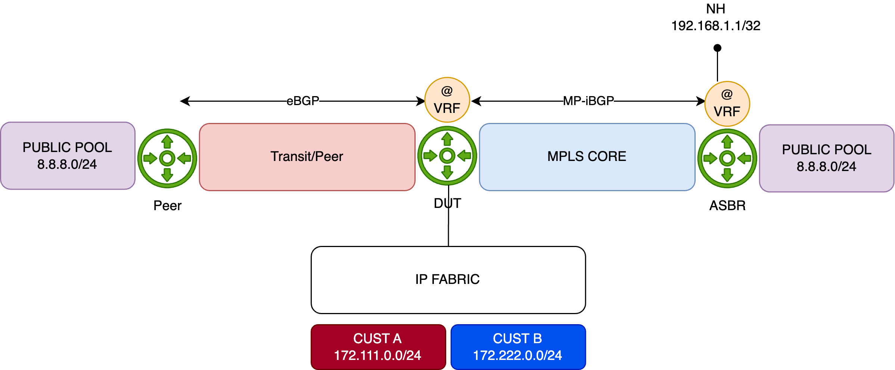
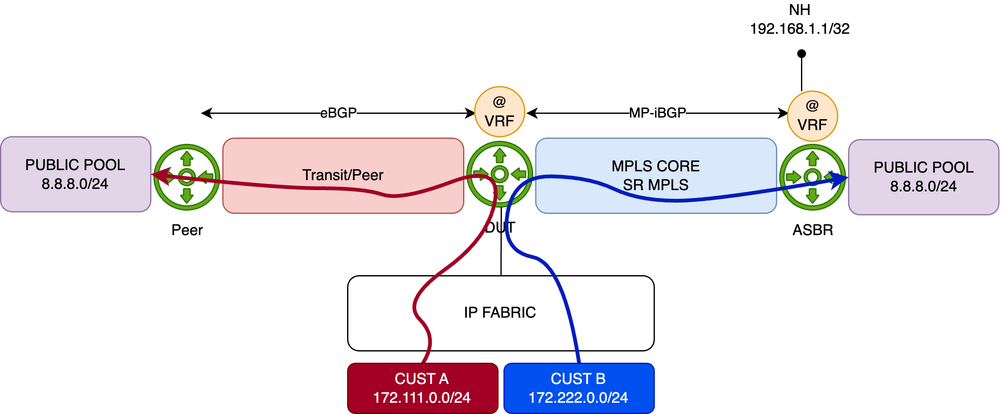
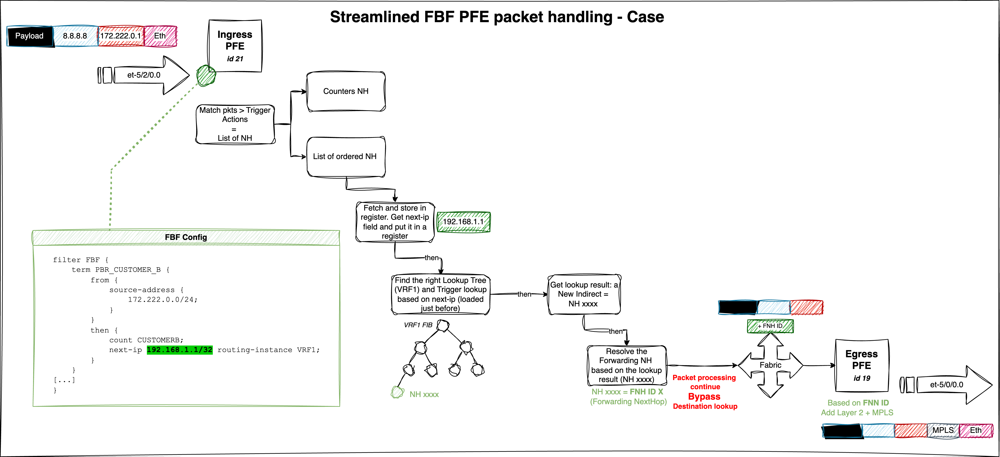

# Case 1 - FBF Using next-ip / next-interface Actions

[RLI 14784](https://deepthought.juniper.net/app/do/showView?taskCode=all&record_code=14784-1&tableName=RLI&record_number=14784) introduces two new terminating actions in firewall filters:

- next-interface <intf-name> routing-instance <RI-name>
- next-ip <prefix> routing-instance <RI-name>

> **Note:** IPv6 is also supported via the `next-ip6` variant.

These actions are **terminating**, meaning there's no need to include an explicit `accept` statement. Both are supported under the `inet` and `inet6` families.

The typical usage for these actions is illustrated below:

```plaintext
firewall {
	family inet|inet6 {
	  filter foo {
	    from { 
	      Any from the set of ip match conditions
	    } then {
	      next-interface <intf-name> routing-instance <RI-name>
      }
    }
  }

  family inet {
	  filter foo4 {
	    from { 
	      Any from the set of ipv4 match conditions
	    } then {
	      next-ip <prefix> routing-instance <RI-name>
      }
    }
  }

  family inet6 {
	  filter foo6 {
	    from { 
	      Any from the set of ipv6 match conditions
	    } then {
	      next-ip6 <prefix> routing-instance <RI-name>
      }
    }
  }
}
```

## Overall Behavior

When a packet matches a term using one of the below actions:

- **`next-interface`**: The system verifies the operational state of the specified interface, along with the availability of an ARP (or ND for IPv6) entry for the next-hop. If a `routing-instance` is specified, the interface lookup is performed within that context. If all conditions are met, the packet is forwarded via the corresponding egress IFL. If the interface is down or unresolved, the packet is dropped.
- **`next-ip(6)`**: The IP address specified in `next-ip` or `next-ip6` is not automatically resolved. On Ethernet interfaces, reachability must be ensured through routing—either via dynamic protocols or static routes. If a matching route (exact or more specific) is found, the packet follows the next-hop associated with that route. If no matching route exists, the packet is **rejected**.

Read carefully: if next-ip address becomes unreachable the default approch is to point the traffic to the default reject next-hop. Traffic rejected are thus punted to the RE for sending back an ICMP unreachable. However, no worries about "overloading" the internal host-path. Indeed, there is a default DDOS protection policer that will rate-limit those rejected punted packets to 2Kpps. We will see later, how to handle this behavior in case you want silencly discard the packet when next-ip address becomes unreachable. 

## Caveats

Known limitations include:

- Supported only for **ingress** filtering
- No fallback mechanism (The EVO **exact** match option is not supported)
- Not supported on **LT** interfaces

## Example 1 - topology

The diagram below illustrates the topology used to demonstrate simple FBF on an MX platform.  
The Device Under Test (**DUT**) is an **MX480** equipped with an **MPC10E** line card.

This simplified setup represents a typical **DCI** router connected to an **IP Fabric**, providing access to remote resources via two distinct paths:

- A **quality** path through an **MPLS/SR** core network, and
- A **best-effort** path via a **direct peering or transit (PNI)** connection.

By default, remote resources are reached via the direct PNI link. The DUT hosts an **Internet VRF**, which is also used by a remote **ASBR** in the same AS. This ASBR advertises "public/remote" prefixes to all PE routers—including the DUT—via **L3VPN (inet-vpn)**. The direct PNI interface is also part of the Internet VRF.



For demonstration purposes, the remote resource is simulated using the public prefix **8.8.8.0/24**. This prefix is preferred by default via the direct PNI, with a backup path available through the MPLS/SR core:

```plaintext
regress@rtme-mx-62> show route 8.8.8.0/24 

VRF1.inet.0: 9 destinations, 13 routes (9 active, 0 holddown, 0 hidden)
+ = Active Route, - = Last Active, * = Both

8.8.8.0/24         *[BGP/170] 00:00:04, localpref 10000
                      AS path: 1234 6000 I, validation-state: unverified
                    >  to 172.16.8.1 via et-2/0/0.0                             <<< Via PNI
                    [BGP/170] 21:23:18, localpref 100, from 193.252.102.201
                      AS path: I, validation-state: unverified
                    >  to 172.16.1.1 via et-5/0/0.0, Push 16, Push 20103(top)   <<< Via MPLS/SR Core
```

The IP Fabric serves two customer types—**A** and **B**—represented by IP prefixes **172.111.0.0/24** and **172.222.0.0/24**, respectively. The DUT exchanges IP traffic with these customers directly.

This is just a table for test:

Table: Interface Naming of the 6xQSFPP PIC

| PFE COMPLEX | Port Number | 10GE mode       | 40GE or 100GE modes |
| ----------- | ----------- | --------------- | ------------------ |
| EA ASIC 0   | 0           | xe-x/1/0:[0..3] | et-x/1/0           |
|             | 1           | xe-x/1/1:[0..3] | et-x/1/1           |
|             | 2           | xe-x/1/2:[0..3] | et-x/1/2           |
|             | 3           | xe-x/1/3:[0..3] | et-x/1/3           |
| EA ASIC 1   | 4           | xe-x/1/4:[0..3] | et-x/1/4           |
|             | 5           | xe-x/1/5:[0..3] | et-x/1/5           |
|             | 6           | xe-x/1/6:[0..3] | et-x/1/6           |
|             | 7           | xe-x/1/7:[0..3] | et-x/1/7           |
| EA ASIC 2   | 8           | xe-x/1/8:[0..3] | et-x/1/8           |
|             | 9           | xe-x/1/9:[0..3] | et-x/1/9           |
|             | 10          | xe-x/1/10:[0..3]| et-x/1/10          |
|             | 11          | xe-x/1/11:[0..3]| et-x/1/11          |

**Initial Configuration**

Below is the initial configuration for the DUT's **Internet VRF**, kept simple for clarity:

- The DUT receives customer prefixes via **eBGP** from the peer group **FABRIC**.
- It receives public prefixes from the peer ASBR via **eBGP**, with an import policy (**PREF**) setting a high **local preference** to make this path the best.
- Two interfaces belong to the Internet VRF—one facing the IP Fabric, and the other towards the PNI peer.
- The DUT also connects to the MPLS core, running **IS-IS with Segment Routing** for label distribution.

```plaintext
regress@rtme-mx-62> show configuration routing-instances VRF1 
instance-type vrf;
protocols {
    bgp {
        group FABRIC {
            type external;
            local-address 172.16.0.4;
            peer-as 5000;
            neighbor 172.16.0.5;
        }
        group PEER {
            type external;
            local-address 172.16.8.0;
            import PREF;
            family inet {
                unicast;
            }
            peer-as 1234;
            neighbor 172.16.8.1;
        }
    }
}
interface et-4/0/0.0;
interface et-5/2/0.100;
route-distinguisher 193.252.102.101:1;
vrf-target target:65000:1234;
vrf-table-label;
```

**Configuration of FBF**

Using the previous topology, we demonstrate a typical FBF use case leveraging the **`next-ip`** action (the same behavior applies to **`next-ip6`** and **`next-interface`**).

The objective is to override the default forwarding behavior—where traffic exits via the direct PNI interface—for traffic sourced from **Customer B** (**172.222.0.0/24**). Instead, traffic from this prefix should be redirected through the **MPLS backbone**, targeting the remote ASBR to reach the public resource.

Traffic from other sources will continue to follow the default “best path,” which remains the direct PNI link.

The diagram below illustrates this behavior:



**How will we achieve this?**

The configuration is straightforward. First, we define a firewall filter that matches the source prefix **172.222.0.0/24**, and apply the `next-ip` action to redirect traffic.

Which `next-ip` address should be used?  
That depends on the network design. In this example, we target the **loopback address of the remote ASBR**, which is advertised via **BGP (L3VPN)**. As shown below, the route to this loopback is reachable through the MPLS/SR core via an established tunnel:

```plaintext
regress@rtme-mx-62> show route 192.168.1.1 table VRF1.inet   

VRF1.inet.0: 9 destinations, 13 routes (9 active, 0 holddown, 0 hidden)
+ = Active Route, - = Last Active, * = Both

192.168.1.1/32     *[BGP/170] 20:42:26, localpref 100, from 193.252.102.201
                      AS path: I, validation-state: unverified
                    >  to 172.16.1.1 via et-5/0/0.0, Push 16, Push 20103(top)
```

Now let's configure the FBF filter. Since we're operating within a **VRF context**, the `routing-instance` parameter is specified along with the `next-ip` action—this ensures that the next-hop lookup is performed in the correct **FIB instance**.

An additional term is included to match all remaining traffic, allowing it to follow the default forwarding behavior.

```plaintext
family inet {
    filter FBF {
        term PBR_CUSTOMER_B {
            from {
                source-address {
                    172.222.0.0/24;
                }
            }
            then {
                count CUSTOMERB;
                next-ip 192.168.1.1/32 routing-instance VRF1;
            }
        }
        term OTHER {
            then {
                count OTHER;
                accept;
            }
        }
    }
}
```

Before applying the filter, we'll generate traffic from **Customer A** and **Customer B**. To distinguish between the two flows, we configure the traffic rates as follows:

- **Customer A**: 1000 packets per second (pps)
- **Customer B**: 5000 packets per second (pps)

Both customers will send traffic toward the **8.8.8.0/24** prefix.

We now start the traffic and verify the statistics on the **PNI interface**:

```plaintext
regress@rtme-mx-62> monitor interface et-2/0/0.0   

<- truncated output ->

Remote statistics:
  Input bytes:                 132708516 (0 bps)                           [0]
  Output bytes:              48292808336 (23518344 bps)             [11195520]
  Input packets:                  270844 (0 pps)                           [0]
  Output packets:               98556757 (6000 pps)                    [22848] <<< Customer A + Customer B traffics
```

At this point, all traffic is following the best active path—via the **PNI interface**—to reach the **8.8.8.0/24** prefix.

Another table just for test:

Table: Interface Naming of the 4xQSFPP PIC

| PFE COMPLEX | Port Number | 10GE mode       | 40GE or 100GE mode |
| ----------- | ----------- | ---------------| ----------------- |
| EA ASIC 0   | 0           | xe-0/0/0:[0..3] | et-0/0/0         |
|             | 1           | xe-0/0/1:[0..3] | et-0/0/1         |
|             | 2           | xe-0/0/2:[0..3] | et-0/0/2         |
|             | 3           | xe-0/0/3:[0..3] | et-0/0/3         |

We now apply the **FBF filter** in the **ingress** direction on the interface connected to the **IP Fabric**:

```plaintext
edit private

set interfaces et-5/2/0 unit 100 family inet filter input FBF

commit comment "ADD_FBF" and-quit
```

And then, recheck the PNI interface statistics: 

```plaintext
regress@rtme-mx-62> monitor interface et-2/0/0.0   
Interface: et-2/0/0.0, Enabled, Link is Up

<- truncated output ->

Remote statistics:
  Input bytes:                 132708516 (0 bps)                           [0]
  Output bytes:              49128737556 (3921056 bps)                     [0]
  Input packets:                  270844 (0 pps)                           [0]
  Output packets:              100262735 (1000 pps)                        [0] <<< Only Customer A traffic
```

The **FBF filter** is functioning as expected. Only **Customer A** traffic continues to follow the default best path toward **8.8.8.0/24** via the PNI interface.

Next, we check the statistics on the **core-facing interfaces** to confirm that **Customer B** traffic is being properly redirected through the **SR/MPLS tunnel** as intended by the FBF configuration:

```
regress@rtme-mx-62> monitor interface et-5/0/0.0  
Interface: et-5/0/0.0, Enabled, Link is Up

<- truncated output ->

Remote statistics:
  Input bytes:                 253750639 (584 bps)                         [0]
  Output bytes:              57241664165 (19600072 bps)                    [0]
  Input packets:                  533880 (1 pps)                           [0]
  Output packets:              116839924 (5000 pps)                        [0] <<< the tunneled Customer B traffic 
```

Everything looks good! To demonstrate that there is no fallback mechanism with **next-ip**-based FBF, we'll remove the **loopback (192.168.1.1/32)** announcement from the ASBR. As a result, the **DUT** will no longer have a route to the loopback, and the traffic will be dropped:

```plaintext
regress@rtme-mx-62> show route 192.168.1.1 table VRF1.inet   

```

This means that traffic from **Customer B** should be dropped, which is exactly what we observe. As shown below, there is no longer any traffic on the **Core interface**, and **Customer A** traffic continues to flow through the **PNI port**.

```plaintext
regress@rtme-mx-62> monitor interface et-5/0/0.0  
Interface: et-5/0/0.0, Enabled, Link is Up

<- truncated output ->

Remote statistics:
  Input bytes:                 253763429 (248 bps)                         [0]
  Output bytes:              58533097602 (0 bps)                          [57]
  Input packets:                  534091 (0 pps)                           [0]
  Output packets:              119475689 (0 pps)                           [1] <<< Customer B traffic dropped

monitor interface et-2/0/0.0 
Interface: et-2/0/0.0, Enabled, Link is Up

<- truncated output ->

Remote statistics:
  Input bytes:                 132708516 (296 bps)                         [0]
  Output bytes:              49685006066 (3921096 bps)                     [0]
  Input packets:                  270844 (0 pps)                           [0]
  Output packets:              101397976 (1000 pps)                        [0] <<< Customer A still forwarded
```

As discussed earlier, the default action when next-ip address becomes unreachable is to redirect traffic to the reject next-hop. Above, we issue a show route of the next-ip address and nothing was return as expected. Just now issue the show route forwarding-table:

```plaintext
regress@rtme-mx-62> show route forwarding-table destination 192.168.1.1 table VRF1    
Routing table: VRF1.inet
Internet:
Destination        Type RtRef Next hop           Type Index    NhRef Netif
default            perm     0                    rjct      695     1       <<< rjct = reject next-hop
```

The route points to reject next-hop in the FIB. As said, the next-hop will punted the packets to the RE for further processing (ICMP unreachable). As also mentioned those punted packet are rate-limited by the ASIC to 2kpps. We can verify this behavior, by checking the DDOS protection statistics for the "reject" protocol:

```plaintext
regress@rtme-mx-62> show ddos-protection protocols reject statistics terse 
Packet types: 1, Received traffic: 1, Currently violated: 1

Protocol    Packet      Received        Dropped        Rate     Violation State
group       type        (packets)       (packets)      (pps)    counts
reject      aggregate   6396663340756   6395549305435  5000     9         viol 
```

We saw our 5K of Customer B traffic before being rate-limited. Issue the "violation" check command to see the rate-limit value of 2K pps: 

```plaintext
regress@rtme-mx-62> show ddos-protection protocols violations 
Packet types: 255, Currently violated: 1

Protocol    Packet      Bandwidth  Arrival   Peak      Policer bandwidth
group       type        (pps)      rate(pps) rate(pps) violation detected at
reject      aggregate   2000       5000      11682678  2025-04-10 08:22:39 PDT  <<< Bandwidth = rate-limit = 2k pps
          Detected on: FPC-5
```

So it means our RE will received a maximum of 2K rejected packets and will generate 2K ICMP unreachable packets in reply. Just check our port connected to the IP Fabric and oh ! Suprise 2Kpps in output. These are our ICMP unreachable sent out back to the Customer B.

```plaintext
regress@rtme-mx-62> monitor interface et-2/0/0.0   
Interface: et-2/0/0.0, Enabled, Link is Up

<- truncated output ->

Remote statistics:
  Input bytes:              117022326356 (23519664 bps)             [11197970]
  Output bytes:                178738122 (895984 bps)                 [426496]
  Input packets:               238821075 (6000 pps)                    [22853]
  Output packets:                3191752 (2000 pps)                     [7616] <<< 2K ICMP Unreachable targeting Cust. B
```

**How we can avoid that?** 

The easiest solution is to have in your FIB always a last resort route entry, that could be discard but why not a fallback path to route the next-ip address. In our case, if 192.168.1.1 deaseappers, we may want:

- to not reject/discard the traffic but move back to the PNI interface. For that we need to configure a static route pointing to PNI peer, with a higher preference as a backup path for 192.168.1.1. Let's do simply add this static route in our VRF and check just after the commit the statistics of our PNI interface to see if all our 6K pps (A+B traffic) are forwarded back:

```plaintext
edit private

set routing-instances VRF1 routing-options static route 192.168.1.1/32 next-hop 172.16.8.1 preference 254

commit comment "ADD_BACKUP_NEXT_IP" and-quit

regress@rtme-mx-62> monitor interface et-2/0/0.0   
Interface: et-2/0/0.0, Enabled, Link is Up

<- truncated output ->

Remote statistics:
  Input bytes:                 132708516 (0 bps)                           [0]
  Output bytes:              50812435866 (23522568 bps)              [5629120]
  Input packets:                  270844 (0 pps)                           [0]
  Output packets:              103698854 (6000 pps)                    [11488] <<< We backup B traffic to PNI
```

- or to silently discard the traffic. In this scenario we can create a static route with higher preference pointing to **discard** next-hop. In our case, I've just added a default discard route in the VRF. so, if 192.168.1.1/32 is not announce anymore, the lookup of the next-ip address will fall back to this default discard instead of matching the default reject. Let's remove the previous static route and add the new default one:

```plaintext
edit private

delete routing-instances VRF1 routing-options static route 192.168.1.1/32          
set routing-instances VRF1 routing-options static route 0.0.0.0/0 discard 

commit comment "ADD_DEFAULT" and-quit
```

So, with this last configuration, our Customer B traffic should be now silently discared and we shouldn't observe DDOS protocol violation and ICMP unreachable traffic:

```plaintext
regress@rtme-mx-62> monitor interface et-2/0/0.0   
Interface: et-2/0/0.0, Enabled, Link is Up
Flags: SNMP-Traps 0x4000
Encapsulation: ENET2
Local statistics:                                                Current delta
  Input bytes:                    216186                                   [0]
  Output bytes:                   505399                                   [0]
  Input packets:                    3530                                   [0]
  Output packets:                   6274                                   [0]
Remote statistics:
  Input bytes:              119682374166 (23516136 bps)              [5628630]
  Output bytes:                230359258 (0 bps)                           [0]
  Input packets:               244249744 (5999 pps)                    [11487]
  Output packets:                4113558 (0 pps)                           [0] <<< No more ICMP Unreach. 


regress@rtme-mx-62> show ddos-protection protocols violations    
Packet types: 255, Currently violated: 0   <<< No more Violation 
```

## PFE analysis 

Now, let’s re-announce the **192.168.1.1/32** prefix and examine how the FBF filter is applied on the **PFE**. Begin by running the following command to access the **PFE CLI**:

```plaintext
regress@rtme-mx-62> start shell pfe network fpc5
```

Next, list all the filters available on the linecard:

```plaintext
root@rtme-mx-62-fpc5:pfe> show firewall 
Name                                   Index          Token            Status
FBF                                    1               2875            DMEM
<- truncated output ->
```

Now resolve the token index `2875` to display the filter’s program:

```plaintext
root@rtme-mx-62-fpc5:pfe> show sandbox token 22571514 

<- truncated output ->

Filter properties: None
Filter state = CONSISTENT
term PBR_CUSTOMER_B
term priority 0
    source-address
        172.222.0/24
        false branch to match action in rule OTHER
 
    then
        accept
        count CUSTOMERB
         Policy Route:
         Destination Prefix: 192.168.1.1
         Routing instance: VRF1
         Policy route action is valid: TRUE
term OTHER
term priority 0
 
    then
        accept
        count OTHER
Previous nodes count: 1      
Next nodes count    : 0      
Entries count       : 0               
```

The above output shows the filter program optimized by the Firewall Filter compiler. To display the actual program pushed into hardware, use the following PFE commands:

```plaintext
root@rtme-mx-62-fpc5:pfe> show firewall instance 
Name,Index              Instance Key                    InstanceToken           LinkCount
FBF,1                   no-next-filter-0                5424                    1
<- truncated output ->
```

Then, run this second command using the Token ID `5424`, retrieved from the previous step:

```plaintext
root@rtme-mx-62-fpc5:pfe> show sandbox token 5424 

<- truncated output ->

JNH_FW_START:
        opcode = 0x0000000c
        anonymous_union_0 = 0x00008605
        filter_id = 0x00000000
        cntr_base = 0x00000001
        flt_base = 0x00000000
        base_ptr = 0x000255af
 
Filter is not interface specific 1
 
Current context : 0.
 
Pfe Inst:0 Hw Instance 1, type:1 op:2 ref 0
  Counter Base:- 0x5400f8
  Policer Base:- 0
  Number of counters : 2 (including PSAs)
 
term PBR_CUSTOMER_B (pfe-inst 0)
     Start Addr   :- 0x8605
     Stop Addr    :- 0x8607
     Stop NH      :- 0x6808255ab012ad58
         Decoding :- FW_STOP: pdesc:0x104ab56 desc:0x4ab56
 
     Action Addr  :- 0x4ab56
     Action NH    :- 0x812aed800010000
 
match type: prefix
  loc: 0x8605 nh: 0x7e30004002800000
  FW_4BMATCH: fwop:0 desc:0x8005 koffset:396 boffset:0 mask:0x149c00e8 data:0x7fb7
 
Inst: 0 Action-Type: 134
        JNH      :- 0x2bfffffd00000300:   <<< count CUSTOMERB;
                 CounterNH: Relative Base = 1, Offset = 0x0, nextNH = 0xffffff
 
Inst: 0 Action-Type: 0
        JNH      :- 0x201282240000000c:   <<< next-ip 192.168.1.1/32 routing-instance VRF1;
                 UcodeNH: Indirect Decode: Indirect, Next = 0x4a089, pnh_id = 0, ,
 
<- truncated output ->
```

Pick the JNH dword corresponding to the next-ip action `0x201282240000000c` (line 40), and decode it:

```plaintext
root@rtme-mx-62-fpc5:pfe> show jnh decode word 0x201282240000000c inst 2    
UcodeNH: Indirect Decode: Indirect, Next = 0x4a089, pnh_id = 0,
```

**UcodeNH** will run a micro-code sequence. Here, it is an indirection to a virtual address found in the **Next** field. To read the data at `0x4a089`, run:

```plaintext
root@rtme-mx-62-fpc5:pfe> show jnh vread vaddr 0x4a089 NH inst 2            
Addr:Nexthop 0x4a089 Paddr:0x104a089, Data = 0x0812659400040000
```

This returns two key values:

- **Paddr** (physical address): `0x104a089`
- **Data** read: `0x0812659400040000`

> Note: To read a physical address, use `show pread paddr xxx`.

Since the value is a JNH word, decode it again. This time it reveals a **CallNH**, a list of ordered next-hops (when **mode=0**):

```plaintext
root@rtme-mx-62-fpc5:pfe> show jnh decode word 0x0812659400040000 inst 2 
CallNH:desc_ptr:0x49965, mode=0, count=0x5
  0x049960  0 : 0x168c000000000000
  0x049961  1 : 0x40101ffffff81510
  0x049962  2 : 0x40181fffffe02030
  0x049963  3 : 0x1810318200200008
  0x049964  4 : 0x23fffffc00000001 <<< this one will be skipped - related to fabric encap.
```

Now decode each action (excluding the fifth one, which is outside the scope of this article):

- The first is a `ModifyNH`, which modifies local memory — in this case, resetting the encapsulation length:

```plaintext
root@rtme-mx-62-fpc5:pfe> show jnh decode word 0x168c000000000000 inst 2    
ModifyNH: Subcode=Misc(26)
(Reset encap len)
```

- The second and third entries are **BitOpNH** actions, performing operations on specific data:

```plaintext
root@rtme-mx-62-fpc5:pfe> show jnh decode word 0x40101ffffff81510 inst 2    
BitOpNH: opcode=0x00000008, data32=0, desc_ptr=0xffffff, key=0x4/0 PPPoE Session ID, op=0, data=49320, nbits=16

root@rtme-mx-62-fpc5:pfe> show jnh decode word 0x40181fffffe02030 inst 2    
BitOpNH: opcode=0x00000008, data32=0, desc_ptr=0xffffff, key=0x6/0 Unknown, op=0, data=257, nbits=16
```

These actions extract the next-ip address from local memory in two steps:

- First, we fetch `49320` (0xC0A8 = 192.168)
- Then, we fetch `257` (0x0101 = 1.1)

Combined, we recover the next-ip address from our FBF filter: **192.168.1.1**. This is a "key" that will be used for further processing (route lookup).

- The fourth NH in the list `0x1810318200200008` is a **KTREE** structure used for route lookup:

> A **KTREE** is Juniper’s implementation of a binary structure known as a **Patricia Tree**.

```plaintext
root@rtme-mx-62-fpc5:pfe> show jnh decode word 0x1810318200200008 inst 2    
KtreeNH: skip=8, sw_token=0, arOffset=0, mode=1, descPtr=0xc60800, key=0x4/0 LookupKey
```

To dump the full KTREE, use:

```plaintext
root@rtme-mx-62-fpc5:pfe> show jnh decode word 0x1810318200200008 inst 2 ktree yes dump yes 
Route                                 Depth   JNH
------------------------------------  ------  ------------------
Default                                    0  0x0812ad6000000000
00000000/32                                1  0x0812a08400000000
080808/24                                  1  0x08129d0400000000
acde00/24                                  2  0x08129df400000000
ac6f00/24                                  2  0x08129df400000000
ac100800/31                                3  0x000000000004ab3c
ac100801/32                                4  0x0812ade000000000
ac100800/32                                4  0x0812ac9800010000
ac100004/31                                3  0x000000000004abc0
ac100005/32                                4  0x08129d4800000000
ac100004/32                                4  0x0812aec800010000
c0a80101/32                                1  0x08129a1800000000 <<< 192.168.1.1/32
e0000001/32                                1  0x0812a0c400000000
ffffffff/32                                1  0x0812a0e400000000
 
Routes found: 14, Bytes used: 6664
```

This KTREE acts as the FIB for our **VRF1** instance. For instance, traffic hitting the **192.168.1.1/32** prefix is redirected to the action identified by the JNH word `0x08129a1800000000`, pointing to a **CallNH**:

```plaintext
root@rtme-mx-62-fpc5:pfe> show jnh decode word 0x08129a1800000000 inst 2    
CallNH:desc_ptr:0x4a686, mode=0, count=0x1
  0x04a685  0 : 0x20129af00000000c
```

This value (`0x20129af00000000c`) is another **UcodeNH** indirection:

```plaintext
root@rtme-mx-62-fpc5:pfe> show jnh decode word 0x20129af00000000c inst 2    
UcodeNH: Indirect Decode: Indirect, Next = 0x4a6bc, pnh_id = 0, ,
```

To follow the indirection, read the next-hop at `0x4a6bc`:

```plaintext
root@rtme-mx-62-fpc5:pfe> show jnh vread vaddr 0x4a6bc NH inst 2            
Addr:Nexthop 0x4a6bc Paddr:0x104a6bc, Data = 0x08129ad400000000
```

Once again, decode the JNH word retrieved from the virtual memory address — it points to another **CallNH** list:

```plaintext
root@rtme-mx-62-fpc5:pfe> show jnh decode word 0x08129ad400000000 inst 2    
CallNH:desc_ptr:0x4a6b5, mode=0, count=0x1
  0x04a6b4  0 : 0x11c0000000026c14
```

Decode the final NH word `0x11c0000000026c14`:

```plaintext
root@rtme-mx-62-fpc5:pfe> show jnh decode word 0x11c0000000026c14 inst 2    
ModifyNH: Subcode=SetNH-Token(7),Desc=0x0,Data=0x26c14,NextNH=0
 (pfeDest:20, TokenIdMode:0/  , VC memberId:0, isReass:0, token:0x26c/620)
```

We’ve reached the final forwarding action — setting the forwarding NH index via the **NH Token**. Here, the token `0x26c` corresponds to the NH ID from our route lookup.

To get more info on this next-hop:

```plaintext
root@rtme-mx-62-fpc5:pfe> show nh db index 0x26c                                   
Index          Type        Func-Type    Proto        Nh-Flags        Ifl-Name        Ifl-Index       Nh-Token        Nh-Prefix
620            Unicast     -            ipv4_tag     0x41            et-5/0/0.0      356             5519           ac100101/32                                   
```

Perfect — this confirms that the traffic is forwarded via the correct path: our core-facing interface `et-5/0/0.0` and doesn't follow anymore the "best path".

To go further (e.g., check Layer 2 headers or MPLS encapsulation), use:

```plaintext
root@rtme-mx-62-fpc5:pfe> show nh detail index 0x26c     
Nexthop Info:

NH Index                      : 620
NH Type                       : Unicast
NH Proto                      : ipv4_tag
NH Flags                      : 0x41
IF Name                       : et-5/0/0.0
Prefix                        : ac100101/32
NH Token Id                   : 5519
NH Route Table Id             : 0
Sgid                          : 0

OIF Index                     : 356
Underlying IFL                : .local..0 (0)
Session Id                    : 788
Num Tags                      : 2
Label                         : 0x4e87eff0 (20103)lbFlags: 0
Label                         : 0x10fff000 (16)lbFlags: 0
MTU                           : 0
L2 Length                     : 12
L2 Data                       : 00:00:01:64:80:00:a8:d0:e5:ef:6a:87
Filter Index                  : 0

Platform Info
-------------
  FabricToken: 5527
  EgressToken: 5526
  IngressFeatures:

Container token: 5519
#5 SetNhToken tokens:
 Mask : 0x0
 [  SetNhToken:5518  ]

  EgressFeatures:

Container token: 5526
#2 PushLabels tokens:
 Mask : 0x0
 [  PushLabels:5522  Token-1:5520  Token-2:5521  ]
#4 StatsCounter tokens:
 Mask : 0x1
 [  StatsCounter:5523  ]
#11 UcastEncap tokens:
 Mask : 0x0
 [  UcastEncap:5524  ]
#12 SetOIF tokens:
 Mask : 0x0
 [  SetOIF:5525  ]
```

The figure below summarizes our packet walkthrough and highlights the main FBF steps:



**And that wraps up part one.** Take a break — in part two, we’ll dive into configuring FBF thanks to the **rib-group** feature.
