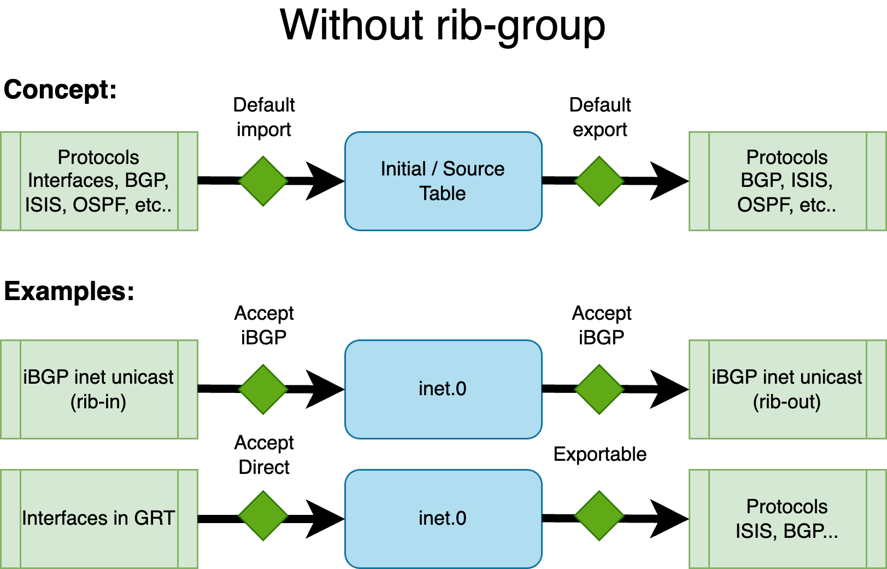
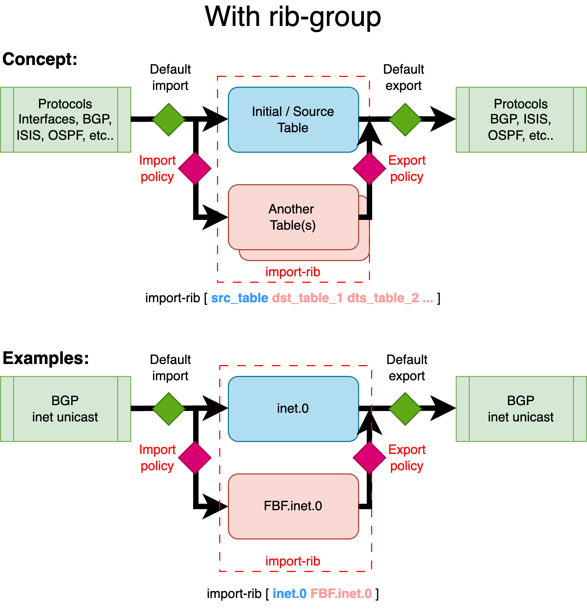
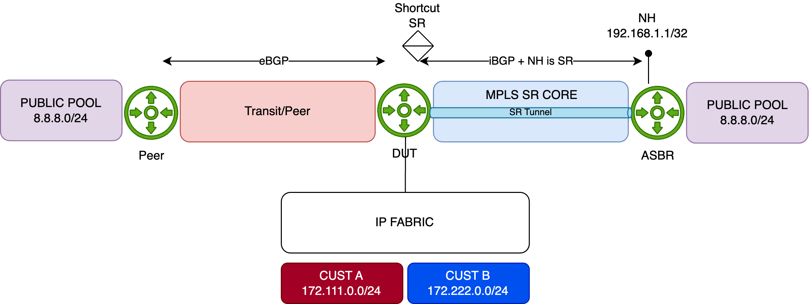
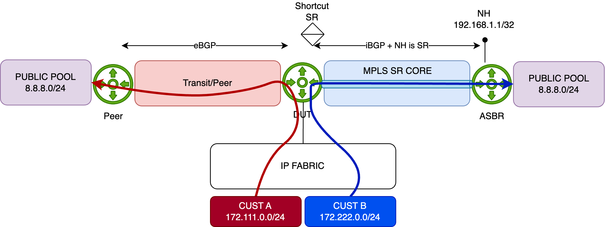
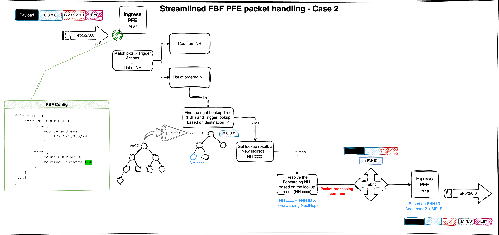

# Case 2 - FBF Using forwarding instance 

The second approach to achieving Filter-Based Forwarding (FBF) leverages the **forwarding-type routing instance**. In this method, the FBF filter term action redirects traffic to a specific routing instance of type `forwarding`.

This solution is considered the legacy approach and is widely supported on MX platforms. Compared to Case 1, it requires a deeper understanding of the **`rib-group`** concept. The following section will elucidate the necessary concepts to effectively implement FBF using this method.

## rib-group Concept

A **RIB group** on Juniper devices enables routes learned in one routing table (the *source* or *initial* RIB) to be simultaneously installed into multiple routing tables (the *destination* RIBs). This feature is commonly utilized to share routes between routing instances (VRFs) or between the global routing table and a VRF. Policies can control which routes are imported, making RIB groups a flexible method for internal route redistribution without relying on BGP or other protocols.

Without a RIB group, each protocol — depending on the address family — feeds routes into a default routing table. In the context of RIB groups, this default table is referred to as the *source* or *initial* RIB. Similarly, protocols fetch routes (for a given family) from this default table when exporting routes.

The figure below illustrates the default routing behavior:



As shown above, for BGP with the `inet` family (IPv4 unicast), the default routing table in the global context is **`inet.0`** — both for importing and exporting routes. Similarly, interface IPv4 addresses (direct routes) in the global context also reside in **`inet.0`**.

To leak routes from one table to another, the **RIB group** feature is employed, configured under **`routing-options`**. A RIB group is defined with the following parameters:

```plaintext
[edit routing-options]
rib-groups {
    <rib-group-name> {
        import-rib [ <source_table> <destination_table_1> <destination_table_2> ... ];
        import-policy <rib-group-import-policy>;
        export-policy <rib-group-export-policy>;
    }
}
```

> **Note:** `import-policy` and `export-policy` are optional, but at least one destination table must be specified in `import-rib`.

The **`import-rib`** statement is crucial. The order of tables matters: the first table is the *source* (or *initial*, *standard*, *contributing*) table. This is the default RIB associated with a given protocol/family combination. With a RIB group, routes are taken from this *source* table and replicated into one or more *destination* tables.

The RIB group establishes a link between the source RIB and the destination RIBs. The **`import-policy`** provides fine-grained control, allowing only specific routes or protocols to be leaked to the destination tables. Similarly, **`export-policy`** controls which routes from the destination tables are eligible for export by routing protocols.

The next figure illustrates the concept:



This example demonstrates how BGP unicast routes from the global routing context are leaked into a new routing table (or instance) called **FBF**. While these routes remain in their default (source) table — **`inet.0`** — they are also copied into an additional table, in this case, the destination **`FBF.inet.0`**, using a RIB group.

In the context of Filter-Based Forwarding (FBF), this allows you to constrain routing decisions to a specific set of routes — not by using the standard FIB, but by relying on a custom FIB built from the custom destination RIB. This destination RIB can be selectively populated with only the routes you want to use for FBF-based traffic steering.

Let's illustrate this second FBF method with an example.

## Example 2 - Topology

The Device Under Test (**DUT**) is an **MX480** equipped with an **MPC10E** line card.

This simplified setup represents a typical **DCI** router connected to an **IP Fabric**, providing access to remote resources via two distinct paths:

- A **quality** path through an **MPLS/SR** core network, and
- A **best-effort** path via a **direct peering or transit (PNI)** connection.

In this scenario, remote resources are reached via the direct PNI link connected in the Global Routing Table (GRT) and sent from the peer to our DUT via an eBGP session. The DUT also receives the same remote resources from a remote **ASBR** through an iBGP session. The remote ASBR sets the next-hop address of these routes with its Segment Routing node-SID (advertised in the ISIS SR domain). This allows for a BGP Free-core by tunneling traffic in a transport SR tunnel.



For demonstration purposes, the remote resource is simulated using the public prefix **8.8.8.0/24**. This prefix is preferred by default via the direct PNI, with a backup path available through the MPLS/SR core (shortcut SR):

```plaintext
regress@rtme-mx-62> show route 8.8.8.0/24 

inet.0: 43 destinations, 44 routes (43 active, 0 holddown, 0 hidden)
+ = Active Route, - = Last Active, * = Both

8.8.8.0/24         *[BGP/170] 6d 17:31:10, localpref 10000
                      AS path: 1234 6000 I, validation-state: unverified
                    >  to 172.16.8.1 via et-2/0/0.0                       <<< PNI
                    [BGP/170] 00:00:11, localpref 50, from 193.252.102.2
                      AS path: I, validation-state: unverified
                    >  to 172.16.1.1 via et-5/0/0.0, Push 20002           <<< SR Tunnel 
```

**Initial Configuration**

Below is the initial configuration for the DUT, kept simple for clarity:

- The DUT receives customer prefixes via **eBGP** from the peer group **FABRIC**.
- The DUT receives public prefixes from the PNI peer—this is the primary/best path. A higher local-preference is set using the `PREF` import policy.
- It also receives public prefixes from the peer ASBR via **iBGP**—this is a backup path—remotely reachable through an MPLS SR Tunnel.

```plaintext
regress@rtme-mx-62> show configuration 
protocols {
    bgp {
        group FABRIC {
            type external;
            local-address 172.16.0.4;
            peer-as 5000;
            neighbor 172.16.0.5;
        }
        group PEER {
            type external;
            local-address 172.16.8.0;
            import PREF;
            family inet {
                unicast;
            }
            peer-as 1234;
            neighbor 172.16.8.1;
        }
        group ASBR {
            type internal;
            local-address 193.252.102.101;
            family inet {
                unicast;
            }
            neighbor 193.252.102.2;
        }
    }
}
```

**Configuration of FBF**

The next steps involve creating a new routing instance (type `forwarding`) and leaking both the interface routes (i.e., `direct` routes for resolving the Layer 2 header) and the remote resources (in our case, 8.8.8.0/24), but only those announced by the core network - not those learned via the PNI.

First, create the FBF routing instance:

```plaintext
edit 
load merge terminal relative

routing-instances {
    FBF {
        instance-type forwarding;
    }
}

commit comment "add_fbf_ri"
```

Next, create a new `rib-group` called **RG_FBF**, establishing a relationship between the `inet.0` table and `FBF.inet.0`. In other words, a relation between the default IPv4 table and the IPv4 table of our newly created **FBF** routing instance.

```plaintext
edit 
load merge terminal relative

routing-options {
    rib-groups {
        RG_FBF {
            import-rib [ inet.0 FBF.inet.0 ];
        }
    }
}

commit comment "add_rib-group"
```

Remember, the order inside the `import-rib` option is important. The first table is considered the source table, and the second one is the destination table. At this point, nothing is leaked between these two tables; this configuration merely establishes the relationship.

The first routes to leak are the direct interfaces attached to `inet.0`. This can be achieved with the following configuration under `routing-options`:

```plaintext
edit 
load merge terminal relative

routing-options {
    interface-routes {
        rib-group inet RG_FBF;
    }
}

commit comment "import-direct"
```

Once committed, you should see `direct` and `local` routes in the `FBF.inet.0` table. Verify with:

```plaintext
regress@rtme-mx-62> show route table FBF.inet.0 

FBF.inet.0: 10 destinations, 10 routes (10 active, 0 holddown, 0 hidden)
+ = Active Route, - = Last Active, * = Both

172.16.0.4/31      *[Direct/0] 6d 20:12:58
                    >  via et-5/2/0.0         <<< Fabric
172.16.0.4/32      *[Local/0] 00:00:59
                       Local via et-5/2/0.0
172.16.1.0/31      *[Direct/0] 6d 20:12:58
                    >  via et-5/0/0.0         <<< Core
172.16.1.0/32      *[Local/0] 00:00:59
                       Local via et-5/0/0.0
172.16.8.0/31      *[Direct/0] 6d 20:12:58
                    >  via et-2/0/0.0         <<< PNI
172.16.8.0/32      *[Local/0] 00:00:59
                       Local via et-2/0/0.0
193.252.102.101/32 *[Direct/0] 6d 20:12:58
                    >  via lo0.0
```

Everything looks good so far. The next step is to leak some BGP routes into the `FBF` routing table. But which ones?

Our goal is to redirect traffic entering this forwarding instance along a specific path — the one advertised by our remote ASBR. This route is available in the default `inet.0` table as a backup path. To achieve this, we'll configure BGP to use the `RG_FBF` rib-group. This rib-group allows routes normally imported into `inet.0` to be simultaneously leaked into `FBF.inet.0`.

Let’s apply this on the `ASBR` peer-group:

```plaintext
edit 
edit protocols
load merge terminal relative

bgp {
    group ASBR {
        type internal;
        local-address 193.252.102.101;  
        family inet {
            unicast {
                rib-group RG_FBF;    <<< This tells BGP to use the rib-group and specifies where to leak learned routes
            }
        }
        neighbor 193.252.102.2;
    }
}

commit comment "import_bgp"
```

With this configuration, all routes received from this peer-group will be leaked into `FBF.inet.0`. However, for demonstration purposes, we’ll restrict the leaking to a specific BGP prefix: **8.8.8.0/24**.

To do that, we’ll use the `import-policy` feature of the rib-group. First, we define a policy to authorize leaking from `inet.0` to `FBF.inet.0`, but only for:

- direct routes, and
- the BGP prefix 8.8.8.0/24

Here’s the policy definition, followed by its application to the `RG_FBF` rib-group:

```plaintext
edit 
load merge terminal relative

policy-options {
    policy-statement FBF_POLICY {
        term LEAK_DIRECT {
            from protocol direct;
            then accept;
        }
        term LEAK_BGP {
            from {
                protocol bgp;
                route-filter 8.8.8.0/24 orlonger;
            }
            then accept;
        }
        term REJECT_OTHER {
            then reject;
        }
    }
}

routing-options {
    rib-groups {
        RG_FBF {
            import-rib [ inet.0 FBF.inet.0 ];
            import-policy FBF_POLICY;         <<< controls which routes get leaked
        }
    }
}

commit comment "add_leaking_policy"
```

After committing, you can verify the result with:

```plaintext
regress@rtme-mx-62> show route table FBF.inet.0 protocol bgp   

FBF.inet.0: 7 destinations, 7 routes (7 active, 0 holddown, 0 hidden)
+ = Active Route, - = Last Active, * = Both

8.8.8.0/24         *[BGP/170] 01:16:31, localpref 50, from 193.252.102.2
                      AS path: I, validation-state: unverified
                    >  to 172.16.1.1 via et-5/0/0.0, Push 20002
```

Perfect — only the 8.8.8.0/24 prefix received from the internal ASBR is installed. The primary route via the PNI isn't present in this instance and remains solely in the `inet.0` table.

Now, to actually redirect the traffic, we’ll use a simple firewall filter. It will match traffic sourced from Customer B and redirect it to the `FBF` routing instance. This filter is applied to the physical interface connected to the IP Fabric:

```plaintext
edit 
load merge terminal relative

firewall {
    family inet {                       
        filter FBF_FWD {
            term CUSTOMER_B {
                from {
                    source-address {
                        172.222.0.0/24;
                    }
                }
                then {
                    count FBF;
                    routing-instance FBF;
                }
            }
            term other {
                then {
                    count OTHER;
                    accept;
                }
            }
        }
    }
}

interfaces {
    et-5/2/0 {
        mtu 9200;
        unit 0 {
            family inet {
                filter {
                    input FBF_FWD;
                }
                address 172.16.0.4/31;
            }
        }
    }
}

commit comment "apply_fbf"
```

At this point, traffic should be redirected as expected:



To help distinguish the flows, we've configured traffic rates as follows:

- **Customer A**: 1000 packets per second (pps)
- **Customer B**: 5000 packets per second (pps)

Let’s monitor the PNI interface. As expected, only Customer A traffic goes through it (1000pps):

```plaintext
regress@rtme-mx-62> monitor interface et-2/0/0.0   
Interface: et-2/0/0.0, Enabled, Link is Up

<- truncated output ->

Remote statistics:
  Input bytes:                 132708516 (0 bps)                           [0]
  Output bytes:              49128737556 (3921056 bps)                     [0]
  Input packets:                  270844 (0 pps)                           [0]
  Output packets:              100262735 (1000 pps)                        [0] <<< Only Customer A traffic
```

Now let’s check the core-facing interface — we can see Customer B’s traffic being redirected via FBF to the ASBR:

```plaintext
regress@rtme-mx-62> monitor interface et-5/0/0.0  
Interface: et-5/0/0.0, Enabled, Link is Up

<- truncated output ->

Remote statistics:
  Input bytes:                 253750639 (584 bps)                         [0]
  Output bytes:              57241664165 (19600072 bps)                    [0]
  Input packets:                  533880 (1 pps)                           [0]
  Output packets:              116839924 (5000 pps)                        [0] <<< the tunneled Customer B traffic 
```

Now, what if the iBGP session to the ASBR drops, or the 8.8.8.0/24 prefix is no longer announced?

In that case, the route will vanish from `FBF.inet.0`, and the default reject route will take over:

```plaintext 
regress@rtme-mx-62> show route forwarding-table destination 0.0.0.0/0 table FBF 
Routing table: FBF.inet
Internet:
Destination        Type RtRef Next hop           Type Index    NhRef Netif
default            perm     0                    rjct      520     1       <<< default reject route
```

Just like in **Case 1**, traffic to 8.8.8.0/24 will be rejected and punted to the routing engine (RE), which will respond with ICMP Unreachable messages (after being HW-policed to 2k pps).

To silently drop such packets instead of punting them, configure a static discard route as the default inside the FBF instance. But what if you want a fallback to the default routing table instead?

That’s simple. If fallback forwarding is needed, just configure a default route inside the FBF instance pointing to the `inet.0` table. If 8.8.8.0/24 disappears, traffic is then forwarded via the primary PNI path through `inet.0`.

Here’s the configuration:

```plaintext 
edit 
load merge terminal relative
 
routing-instances {
    FBF {
        instance-type forwarding;
        routing-options {
            static {
                route 0.0.0.0/0 next-table inet.0; <<< default fallback route
            }
        }
    }
}

commit comment "add_fallback_route"
```

## PFE analysis  

Assuming the FBF configuration is active, let’s break down how the firewall filter behaves at the PFE level. Start by listing the filter instances:

```plaintext
regress@rtme-mx-62> start shell pfe network fpc5 

root@rtme-mx-62-fpc5:pfe> show firewall instance     
Name,Index              Instance Key                    InstanceToken           LinkCount
FBF_FWD,2                       no-next-filter-0                4777            1
<- truncated output ->
```

Next, pick up the **InstanceToken** and resolve it using the following command:

```plaintext
root@rtme-mx-62-fpc5:pfe> show sandbox token 4777        

<- truncated output ->

Pfe Inst:0 Hw Instance 1, type:1 op:2 ref 0
  Counter Base:- 0x5400e8
  Policer Base:- 0
  Number of counters : 2 (including PSAs)
 
term CUSTOMER_B (pfe-inst 0)
     Start Addr   :- 0x85fc
     Stop Addr    :- 0x85fe
     Stop NH      :- 0x680825491812a48c
         Decoding :- FW_STOP: pdesc:0x104a923 desc:0x4a923
 
     Action Addr  :- 0x4a923
     Action NH    :- 0x812a81c00020000
 
match type: prefix
  loc: 0x85fc nh: 0x7e3000401e000000
  FW_4BMATCH: fwop:0 desc:0x803c koffset:396 boffset:0 mask:0x149c00e8 data:0x7fb7
 
Inst: 0 Action-Type: 134
        JNH      :- 0x2bfffffd00000300:
                 CounterNH: Relative Base = 1, Offset = 0x0, nextNH = 0xffffff
 
Inst: 0 Action-Type: 0
        JNH      :- 0x23fffffc0000100c:
                 UcodeNH: Indirect Decode: Indirect, Next = 0xffffff, pnh_id = 0, ,
 
Inst: 0 Action-Type: 0
        JNH      :- 0x20129a4c0000000c:
                 UcodeNH: Indirect Decode: Indirect, Next = 0x4a693, pnh_id = 0, ,

<- truncated output ->
```

Focus on the **Action NH** (line 17) and decode the **JNH** word. As shown, this represents a chain of Next-hops:

> The parameter `inst` below refers to the PFE id. 

```plaintext
root@rtme-mx-62-fpc5:pfe> show jnh decode word 0x812a81c00020000 inst 2     
CallNH:desc_ptr:0x4aa07, mode=0, count=0x3
  0x04aa04  0 : 0x2bfffffd00000300  <<< Action Counter
  0x04aa05  1 : 0x23fffffc0000100c  <<< dummy action for clearing some internal states
  0x04aa06  2 : 0x20129a4c0000000c  <<< Action routing-instance FBF 
```

Now let’s analyze the third action by decoding the JNH word `0x20129a4c0000000c` - **UcodeNH** will execute a micro-code sequence:

```plaintext
root@rtme-mx-62-fpc5:pfe> show jnh decode word 0x20129a4c0000000c inst 2   
UcodeNH: Indirect Decode: Indirect, Next = 0x4a693, pnh_id = 0, ,
```

This is an indirection to a virtual address found in the **Next** field. To read data at `0x4a693`, use:

```plaintext
root@rtme-mx-62-fpc5:pfe> show jnh vread vaddr 0x4a693 NH inst 2            
Addr:Nexthop 0x4a693 Paddr:0x104a693, Data = 0x0812944c00020000
```

This yields two important values:

- **Paddr** (physical address): `0x104a693`
- **Data** read: `0x0812944c00020000`

> Note: to read a physical address, use `show pread paddr xxx`.

Since this is a JNH word, decode it again:

```plaintext
root@rtme-mx-62-fpc5:pfe> show jnh decode word 0x0812944c00020000 inst 2    
CallNH:desc_ptr:0x4a513, mode=0, count=0x3
  0x04a510  0 : 0x168c000000000000
  0x04a511  1 : 0x08129d1c00000000
  0x04a512  2 : 0x23fffffc00000001  <<< this one will be skipped - related to fabric encap. 
```

Now decode each action (except the third one - out of the scope of this article):

- First is a `ModifyNH` (we modify some bytes of the Local Memory - here we reset en encap len)

```plaintext
root@rtme-mx-62-fpc5:pfe> show jnh decode word 0x168c000000000000 inst 2    
ModifyNH: Subcode=Misc(26)
(Reset encap len)
```

- Second points to another JNH word `0x1810318100200008` - This one is a **CallNH** which means execute a list of NH in order (when `mode=O`):

```plaintext
root@rtme-mx-62-fpc5:pfe> show jnh decode word 0x08129d1c00000000 inst 2    
CallNH:desc_ptr:0x4a747, mode=0, count=0x1
  0x04a746  0 : 0x1810318100200008
```

Decode the first and single NH in the list, `0x1810318100200008` to reveal a **KTREE** structure used for route lookup:

> A **KTREE** is the Juniper implementation of a standard binary structure known as **Patricia Tree**

```plaintext
root@rtme-mx-62-fpc5:pfe> show jnh decode word 0x1810318100200008 inst 2    
KtreeNH: skip=8, sw_token=0, arOffset=0, mode=1, descPtr=0xc60400, key=0x4/0 LookupKey
```

Use additional options to dump the full KTREE:

```plaintext
root@rtme-mx-62-fpc5:pfe> show jnh decode word 0x1810318100200008 inst 2 ktree yes dump yes 
Route                                 Depth   JNH
------------------------------------  ------  ------------------
Default                                    0  0x08129df400000000
00000000/32                                1  0x08129d4000000000
080808/24                                  1  0x0812a04000000000  <<< 8.8.8.0/24 entry
<- truncated output ->
```

This KTREE acts as the FIB for our FBF routing-instance. For example, if traffic hits the 8.8.8.0/24 prefix, it’s "redirected" to the action identifed by the JNH word `0x0812a04000000000` which refers to a list of NH (**CallNH**):

```plaintext
root@rtme-mx-62-fpc5:pfe> show jnh decode word 0x0812a04000000000 inst 2    
CallNH:desc_ptr:0x4a810, mode=0, count=0x1
  0x04a80f  0 : 0x2012a0a40000000c
```

Whose the value `0x2012a0a40000000c` refers to indirection - **UcodeNH**:

```plaintext
root@rtme-mx-62-fpc5:pfe> show jnh decode word 0x2012a0a40000000c inst 2    
UcodeNH: Indirect Decode: Indirect, Next = 0x4a829, pnh_id = 0, ,
```

To read this NH indirection at the virtual address `0x4a829`:

```plaintext
root@rtme-mx-62-fpc5:pfe> show jnh vread vaddr 0x4a829 NH inst 2                               
Addr:Nexthop 0x4a829 Paddr:0x104a829, Data = 0x0812a5fc00000000
```

One mmore time, we decode the JNH word retrieved from the previous virtual memory address - and we find out a new list of NH (**CallNH**):

```plaintext
root@rtme-mx-62-fpc5:pfe> show jnh decode word 0x0812a5fc00000000 inst 2    
CallNH:desc_ptr:0x4a97f, mode=0, count=0x1
  0x04a97e  0 : 0x11c0000000038d14
```

And decode `0x11c0000000038d14`:

```plaintext
root@rtme-mx-62-fpc5:pfe> show jnh decode word 0x11c0000000038d14 inst 2    
ModifyNH: Subcode=SetNH-Token(7),Desc=0x0,Data=0x38d14,NextNH=0
 (pfeDest:20, TokenIdMode:0/  , VC memberId:0, isReass:0, token:0x38d/909)
```

We’ve reached the final forwarding result — which will set the forwarding NH index into the **NH Token**. Here, the token `0x38d` corresponds to the NH ID of our lookup result.

You can get more info on this NH:

```plaintext
root@rtme-mx-62-fpc5:pfe> show nh db index 0x38d 
Index          Type        Func-Type    Proto        Nh-Flags        Ifl-Name        Ifl-Index       Nh-Token        Nh-Prefix
909            Unicast     -            ipv4_tag     0x1             et-5/0/0.0      356             5187           ac100101/32         
```

Perfect — this matches expectations. Traffic targeting 8.8.8.0/24 via the FBF routing instance will be forwarded to the core interface `et-5/0/0.0`.

You can dig deeper using this detailed view (to retrieve Layer 2 header information, MPLS encap...)

```plaintext
root@rtme-mx-62-fpc5:pfe> show nh detail index 0x38d 
Nexthop Info:

NH Index                      : 909
NH Type                       : Unicast
NH Proto                      : ipv4_tag
NH Flags                      : 0x1
IF Name                       : et-5/0/0.0
Prefix                        : ac100101/32
NH Token Id                   : 5187
NH Route Table Id             : 0
Sgid                          : 0

OIF Index                     : 356
Underlying IFL                : .local..0 (0)
Session Id                    : 788
Num Tags                      : 1
Label                         : 0x4e22fff0 (20002)lbFlags: 0
MTU                           : 0
L2 Length                     : 12
L2 Data                       : 00:00:01:64:80:00:a8:d0:e5:ef:6a:87
Filter Index                  : 0

Platform Info
-------------
  FabricToken: 5193
  EgressToken: 5192
  IngressFeatures:

Container token: 5187
#5 SetNhToken tokens:
 Mask : 0x0
 [  SetNhToken:5186  ]

  EgressFeatures:

Container token: 5192
#2 PushLabels tokens:
 Mask : 0x0
 [  PushLabels:5188  ]
#4 StatsCounter tokens:
 Mask : 0x1
 [  StatsCounter:5189  ]
#11 UcastEncap tokens:
 Mask : 0x0
 [  UcastEncap:5190  ]
#12 SetOIF tokens:
 Mask : 0x0
 [  SetOIF:5191  ]  
```

If we repeat the exercise with the 8.8.8.0/24 prefix no longer present in the `FBF.inet.0` table, any traffic destined for 8.8.8.0/24 will match the default 0/0 route, which redirects to the `inet.0` table via a `next-table` action. In this scenario, we would notice slightly longer processing — just a few extra instructions — due to the need for two lookups:

- The first lookup occurs in the FBF FIB instance, which triggers the **next-table** action and redirects the processing to the main IPv4 `inet.0` table,
- The second lookup happens in the `inet.0` FIB, where the best route to 8.8.8.0/24 is selected—in our case, through interface et-2/0/0.0, which connects to our PNI.

> In this situation, two KTREE structures are involved: first the `FBF.inet.0` KTREE, followed by the `inet.0` KTREE.

and another table - just for illustration

Table: Interface Naming of the 8xSFP+ PIC

| PFE COMPLEX | Port Number | 10GE mode |
| ----------- | ----------- | ----------|
| EA ASIC 0   | 0           | xe-0/1/0 |
|             | 1           | xe-0/1/1 |
|             | 2           | xe-0/1/2 |
|             | 3           | xe-0/1/3 |
|             | 4           | xe-0/1/4 |
|             | 5           | xe-0/1/5 |
|             | 6           | xe-0/1/6 |
|             | 7           | xe-0/1/7 |

The following figure provides a consolidated view of the packet traversal process and outlines the key steps of the FBF mechanism:



This is a test to refer to this [section](chapter1.md#overall-behavior)

## Conclusion 

In this article, we explored the mechanics of the **Filter-Based Forwarding (FBF)** feature, focusing on how traffic steering is implemented at the PFE level. We demonstrated **two distinct approaches** to configuring and validating FBF behavior. While both are effective, the second method provides **greater flexibility**, making it especially useful for advanced use cases.

All tests and examples provided were conducted within the **IPv4 address family**, but it's important to highlight that the same FBF logic and infrastructure are **fully supported for IPv6** as well, offering consistent behavior across protocol versions.

By understanding the inner workings of FBF down to the hardware abstraction layer, network engineers can confidently design and validate sophisticated traffic steering policies.