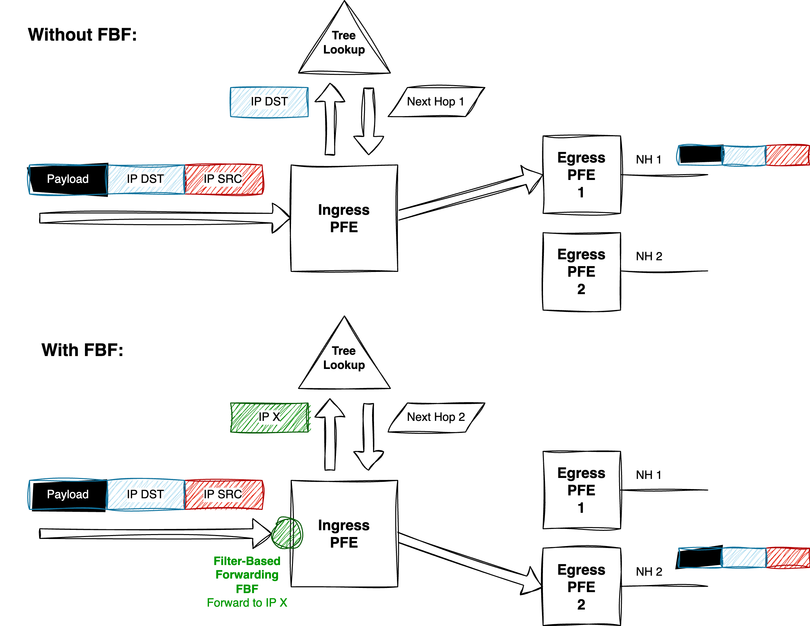

# Goal of this Article

This article provides a detailed overview of Filter-Based Forwarding (**FBF**), also known as Policy-Based Routing (**PBR**), on MX Series routers (AFT), using common deployment scenarios to illustrate configuration methods.  

The Filter-Based Forwarding (FBF) concept is relatively simple. On ingress, filtering (via the Firewall Filter toolkit) is applied *before* the the source or destination route lookup. The diagram below illustrates this process. In a standard routing scenario without any constraints, the destination IP from the IP datagram is used for a rou te lookup (using Longest Prefix Match[^1]), which returns a next-hop and an associated egress interface. (Encapsulation may occur prior to egress.)

With FBF, we alter the ingress lookup behavior in one of the following ways:

- Forcing traffic to exit through a specific egress port;
- Using a "proxy" or alias IP address as the lookup key (as shown in our example below);
- Leveraging a specific, constrained forwarding instance to influence the lookup outcome.

{width=100%}

To summarize, on Juniper platforms, FBF can generally be implemented using two main approaches. The first is more straightforward and involves minimal configuration, but offers limited flexibility. It uses a single firewall filter to directly redirect traffic. The second approach requires slightly more configuration but offers more granular traffic handling.

All examples are based on Junos OS release **24.2**. We’ll begin with the simpler method.

[^1]: aka. LPM
